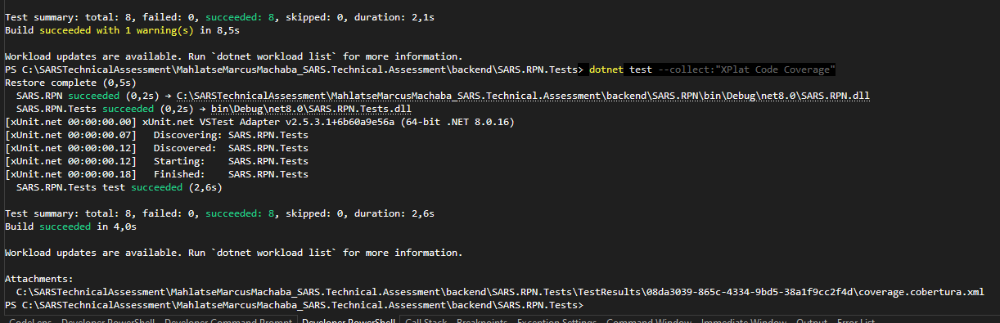
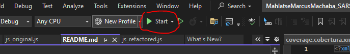
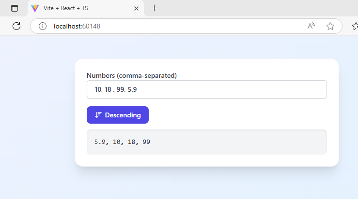
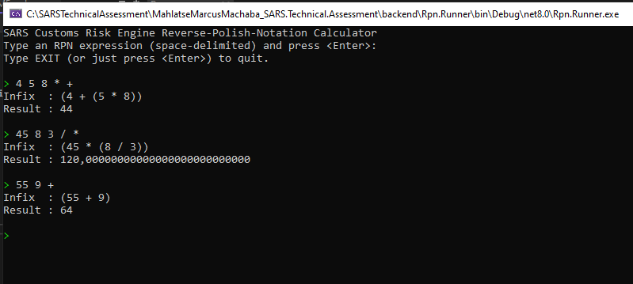

# SARS Technical Assessment 🧑‍💻

**Technologies**  
* **Frontend** — Vite + React 18 (TypeScript, Tailwind CSS, Framer Motion)  
* **Backend** — .NET 8 class library (`Sars.Rpn`) with xUnit tests  
* **Misc** — Fluent icons via `lucide-react`, MSBuild composite builds, project-level analyzers  

> **Clone • Install • Run** – the whole solution spins up in **< 60 seconds** on any machine with Node ≥ 18 and .NET SDK ≥ 8.

---

## 📁 Repository layout

```text
├── backend/                 # Part 2: C# Application (Backend / Logic)
│   ├── Sars.Rpn/              # core library
│   └── Sars.Rpn.Tests/        # xUnit tests
│
├── console/
│   └── Rpn.Runner/            # demo REPL for quick manual checks
│
├── frontend/                # Part 1: ReactJS Application (Frontend)
│   └── reactapp_frontend/     # Vite React 18 + Tailwind app
│       ├── src/
│       │   ├── components/
│       │   ├── hooks/
│       │   └── ...
│       ├── tailwind.config.js
│       └── tsconfig.*.json
│
├── code-review/             # Part 3 – refactor & rationale/reasoning
│   ├── js-original.js
│   ├── js-refactor.js
│   ├── cs-original.cs
│   ├── cs-refactor.cs
│   └── README.md
│
└── Directory.Build.props    # nullable + analyzer rules for all C# projects
```                                                      

---

## 🚀 Quick-start (developer workflow)

```bash
# Clone + enter
git clone https://github.com/MarcusMachaba/SarsTechnicalAssessment.git
cd SarsTechnicalAssessment

# --- Frontend ---
cd frontend/reactapp_frontend
npm install            # installs React, Vite, Tailwind, etc.
npm run dev            # opens http://localhost:5173

# --- Backend ---
cd ../../backend/Sars.Rpn
dotnet test            # builds & runs all unit tests

# --- Console demo ---
cd ../../console/Rpn.Runner
dotnet run             # interactive RPN REPL
```

```bash
# Alternative is through visual studio 2022 on solution explorer - right-click solution & navigate to properties.
# Then on the Properties popup page on Rpn.Runner & react_frontend projects set the Action to 'start' - then after that all you need to do is to just click the visual studio start button.
# What that will do is it will run both the react-app & Rpn.Runner console demo app._

```
### 1 Set multiple project startup
 

### 2 Run/start the solution


---

## 🎯 Key NPM/Yarn/PNPM scripts (frontend)

| Script    | Purpose                                    |
|-----------|--------------------------------------------|
| `dev`     | Vite dev server with HMR                   |
| `build`   | Type-check (`tsc -b`) + production bundle  |
| `preview` | Serves the build output locally            |
| `lint`    | ESLint + TypeScript rules                  |

⚡ Add `--host` to `npm run dev` if you want LAN / mobile testing.

---

## ⚖️ Unit-test matrix (backend)

| File                                    | Scenario tested                                                          |
|-----------------------------------------|--------------------------------------------------------------------------|
| `InfixConverterTests.cs`                | simple add, precedence, decimals, invalid token, insufficient operands   |
| `EvaluatorTests.cs` *(additional bonus)*| multi-operator expression vs expected numeric result                     |

```bash
# Run everything with coverage
dotnet test --collect:"XPlat Code Coverage"

Coverlet collector is pre-installed; use ReportGenerator for HTML reports if desired.
```

---

## 📝 Part 3 – Code-Review & Refactor

| Language    | Before                                                     | After                                                |
|-------------|------------------------------------------------------------|------------------------------------------------------|
| JavaScript  | [`code-review/js-original.js`](code-review/js_original.js) | [`code-review/js-refactored.js`](code-review/js_refactored.js) |
| C#          | [`code-review/cs-original.cs`](code-review/cs_original.cs) | [`code-review/cs-refactored.cs`](code-review/cs_refactored.cs) |

See **[`code-review/README.md`](code-review/README.md)** for a point-by-point rationale of the improvements.

---

## 🖥 Console RPN runner

```text
SARS Customs Risk Engine Reverse-Polish-Notation Calculator
Type an RPN expression (space-delimited) and press <Enter>:
Type EXIT (or just press <Enter>) to quit.

> 3 4 5 * +
Infix  : (3 + (4 * 5))
Result : 23

> exit
Good-bye!
```

---

## 🔍 Code style & safety

* **C#** Nullable reference types **enabled** (`<Nullable>enable`) and the latest Roslyn analyzers (`<AnalysisLevel>latest`) via **`Directory.Build.props`**.  
* **TypeScript** Compiler in **strict** mode with `exactOptionalPropertyTypes`, `noUnusedLocals`, `noUnusedParameters`, etc.  
* **ESLint** Rule-set drawn from **eslint**, **@typescript-eslint**, and **eslint-plugin-react-hooks** for consistent React-specific best practices.


---

## 🧪 Test Strategy

### Part 1: ReactJS Application

This tool accepts a comma-separated string of numbers and displays them in sorted order.

**Testing Focus Areas:**

- ✅ Input validation
- ✅ Sorting logic
- ✅ UI toggle behavior
- ✅ Error message display

**Test Scenarios:**

| Test Case          | Description                                                  |
| ------------------ | ------------------------------------------------------------ |
| `Valid input`      | Input: `3,1,5` → Should render `[1, 3, 5]` and `[5, 3, 1]`   |
| `Invalid input`    | Input: `2,a,4` → Show validation error                       |
| `Whitespace input` | Input: `1 , 2 , 3` → Should still process correctly          |
| `Decimal numbers`  | Input: `1.5, 2.3, 0.1` → Sorted accordingly                  |
| `Empty input`      | Show "Please enter a value" or similar                       |
| `Toggle switch`    | Clicking toggle swaps between ascending/descending order     |
| `Long input`       | Input like `1000,999,...` → Handle performance and rendering |

> 💡 *Can additionally use Jest and React Testing Library (RTL) for component/unit testing.*

---

### Part 2: C# RPN Parser

This parser converts RPN expressions to human-readable infix notation and optionally evaluates them.

**Testing Focus Areas:**

- ✅ Parsing correctness and grouping
- ✅ Operator precedence
- ✅ Robust error handling
- ✅ Result evaluation (bonus)

**Test Scenarios:**

| Test Case          | Input               | Expected Output                             |
| ------------------ | ------------------- | ------------------------------------------- |
| `Basic RPN`        | `3 4 +`             | Infix: `(3 + 4)`                            |
| `Multi-operator`   | `5 1 2 + 4 * + 3 -` | `((5 + ((1 + 2) * 4)) - 3)`                 |
| `Invalid input`    | `3 +`               | Throws or returns parse error               |
| `Decimal support`  | `2.5 3.5 +`         | `(2.5 + 3.5)`                               |
| `Evaluation`       | `3 4 5 * +`         | Infix: `(3 + (4 * 5))`, Result: `23`        |
| `Division by zero` | `4 0 /`             | Should handle gracefully or raise exception |
| `Empty input`      | `""`                | Return "No expression provided"             |

> 💡 *Using xUnit for unit tests. Covers edge cases for resilience.*

---

## 🖼 UI Preview

### React Sorting Interface
 

### Console RPN Runner


### Unit Test Output


---

## 📬 Submission Info

Submitted by: **Marcus Machaba**  
GitHub: [@MarcusMachaba](https://github.com/MarcusMachaba)  
Email: smaka1236@gmail.com  
